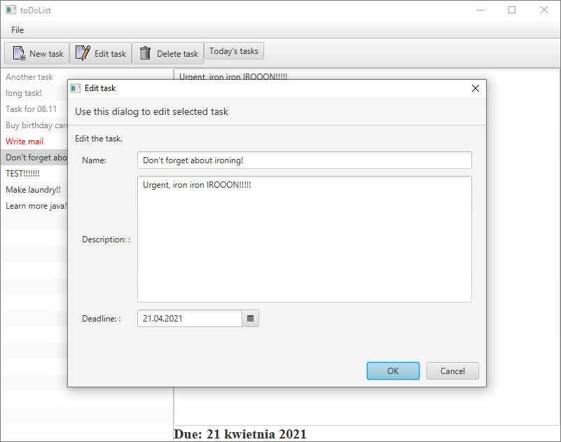

# journal-app
[![Issues][issues-shield]][issues-url]
[![LinkedIn][linkedin-shield]][linkedin-url]

<!-- PROJECT LOGO -->
 

  

  <h3 align="center">ToDoList App</h3>

  

     README toDoList 
     
    <a href="https://github.com/m-wrobel91/toDoListJavaFX"><strong>Explore the docs »</strong></a>
     
         <a href="https://github.com/m-wrobel91/toDoListJavaFX/issues">Report Bug</a>
    ·
    <a href="https://github.com/m-wrobel91/toDoListJavaFX/issues">Request Feature</a>
  

  

<!-- TABLE OF CONTENTS -->

  
Table of Contents

  <ol>
    <li>
      <a href="#about-the-project">About the Project</a>
      <ul>
        <li><a href="#built-with">Built with</a></li>
        <li><a href="#more-to-go">More to go</a></li>
      </ul>
    </li>
    <li><a href="#contact">Contact</a></li>
  </ol>

<!-- ABOUT THE PROJECT -->
## About The Project
  
 Application is a simple todo list.  User may add new tasks, edit existing ones or delete the task. Tasks whoch deadline expired are coloured grey. The tasks which deadline is today are coloured red. The tasks are written to and read from a text file. 

  <figure>
    
     
    
Fig.1 - Screenshot from the application.

    </figure>

This project was created in order to get acquinted with Java FX.

  <figure>
    
     
    
Fig.2 - Task edition window.

    </figure>

### Built With

Below find  major frameworks that was used to build project. 
* [Java FX](https://www.oracle.com/java/technologies/javase/javafx-overview.html)

### More to go
There is number of functionalities that might be added to the application such as:
- email notification while task deadline is within 3 days.
- replace saving into the text file with some DB.

<!-- CONTACT -->
## Contact

Michał Wróbel 
- [Github page](https://github.com/m-wrobel91)
- [Linkedin page](https://www.linkedin.com/in/micha%C5%82-wr%C3%B3bel-85055012a/)

<!-- MARKDOWN LINKS & IMAGES -->

[issues-shield]: https://img.shields.io/github/issues/m-wrobel91/journal-app.svg?style=for-the-badge
[issues-url]: https://github.com/m-wrobel91/Best-README-Template/issues

[linkedin-shield]: https://img.shields.io/badge/-LinkedIn-black.svg?style=for-the-badge&logo=linkedin&colorB=555
[linkedin-url]: https://www.linkedin.com/in/micha%C5%82-wr%C3%B3bel-85055012a/
[github-url]: https://github.com/m-wrobel91
[app-logo]: images/book-solid.svg
